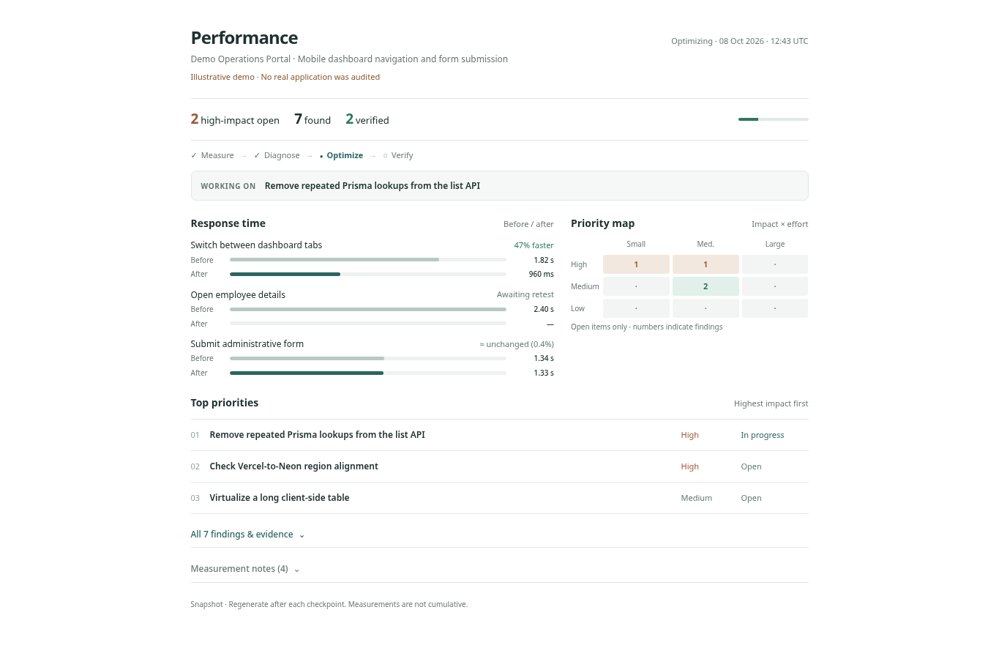

# ZeroLag

**One command. One workflow. Measure → diagnose → prioritize → fix → verify.**

**Diagnose and eliminate real webapp latency.** ZeroLag is a version-aware Claude Code skill for React, Next.js, Vercel, Prisma and Neon/PostgreSQL. It coordinates official guidance, checks the complete user interaction path and keeps users informed with one-screen reports after each meaningful fix.

## A one-screen performance brief

**[View the offline HTML demo](examples/demo-report.html)** — synthetic example, not a live audit.



The **default view** contains just:

- **3 numbers:** high-impact open, found, verified.
- **1 next action** and a short progress line.
- **2 tiny diagrams:** before/after timing bars and an impact × effort heatmap.
- **3 priorities:** the most actionable items ranked by impact.

All findings, evidence and caveats remain available in expandable sections. The Markdown export is equally short; the JSON preserves the full audit. No invented speedups or cumulative gains. The HTML is a static, offline snapshot regenerated after each checkpoint.

Design direction: Impeccable [distill](https://impeccable.style/docs/distill/), [quieter](https://impeccable.style/docs/quieter/), [polish](https://impeccable.style/docs/polish/).

## What ZeroLag actually checks

| Browser + React | Next.js + backend | Data + infrastructure |
|---|---|---|
| INP, main thread, rendering, list virtualization | Request waterfalls, Server Actions, streaming, prefetch | N+1 queries, SQL plans, indexes, pool pressure |
| Transitions, deferred UI, JS payloads | Next.js 16 cache model, invalidation, user/tenant safety | Neon cold starts, Vercel regions, CPU throttling |

It reviews **14 performance areas** including input delay, React rendering, mobile tables/forms, routing, network, caching, SQL/indexes, pooling, cold starts, cloud runtime, bundles, background jobs and regression gates. Findings explicitly distinguish **measured bottlenecks** from **unverified hypotheses**. The complete, source-linked techniques are in [the playbook](.claude/skills/zerolag/references/performance-playbook.md) and [measurement protocol](.claude/skills/zerolag/references/measurement-protocol.md). This is not a promise that applying every trick makes the app faster.

## 1. Install the underlying tools

Run in the **application repository**:

```bash
npx skills add vercel-labs/agent-skills --skill vercel-react-best-practices --agent claude-code -y
npx skills add vercel-labs/agent-skills --skill vercel-optimize --agent claude-code -y
```

Inside **Claude Code** (these `/plugin` commands run in the interactive session):

```text
/plugin marketplace add ChromeDevTools/chrome-devtools-mcp
/plugin install chrome-devtools-mcp@chrome-devtools-plugins
/plugin marketplace add neondatabase/agent-skills
/plugin install neon-postgres@neon
```

Restart Claude Code to load plugins; authenticate to Neon when requested. Dependencies are optional: without access, the skill must disclose its diagnostic limitations. Use already-installed **Impeccable** when refining the report template or fixing measured frontend UX bottlenecks, not in place of tracing server/database time.

**Optional Vercel telemetry:**

```bash
npm i -g vercel@latest
vercel login
vercel link
```

> `vercel-optimize` requires Vercel CLI 53+ and **Observability Plus** for route-level telemetry. When this is unavailable, use browser/local evidence instead. Do not silently invoke its scanner-only mode without the permission required by that skill. Never enable paid features without approval.

## 2. Install this orchestrator skill

Copy the **entire** `.claude/skills/zerolag/` directory (including `scripts/` and `references/`) into either:

- `<your-app>/.claude/skills/zerolag/` (project-level), or
- `~/.claude/skills/zerolag/` (personal, across projects).

Python **3.10+** is required for report rendering, with **no third-party packages**. To install from the standalone `skill.zip` package, run `mkdir -p .claude/skills && unzip -o ~/Downloads/skill.zip -d .claude/skills` from the app root; the ZIP contains the `zerolag/` folder.

**Upgrading from the old name:** install `zerolag/` first, check for local customizations, then remove the obsolete `rocketspeed/` and/or `fullstack-latency-optimizer/` skill directories. Restart Claude Code and invoke `/zerolag`. Avoid multiple copies of the same skill under different names.

### Share with coworkers

Commit `.claude/skills/zerolag/` into your existing app repository; coworkers can `git pull`, reopen Claude Code and invoke `/zerolag`. Each coworker configures optional Chrome/Neon/Vercel tools separately. For personal installation across repos, copy the whole directory to `~/.claude/skills/zerolag/`.

## 3. Run one complete pass

From the app root:

```bash
claude
```

In Claude Code:

```text
/zerolag
```

Or give it a specific target:

```text
/zerolag slow mobile dashboard tab switching
```

The skill will:

1. **Baseline** up to three reproducible slow workflows.
2. **Detect and rank all supported opportunities** (high → low), producing the first report **before code changes**.
3. **Fix up to three** high-impact bottlenecks, one by one.
4. **Remeasure, retest, and refresh the report after each fix**.
5. **Hand off** final evidence and remaining opportunities.

### Output files in your app repository

```text
PERFORMANCE_FINDINGS.json  # source of truth, updated as findings change
PERFORMANCE_REPORT.html    # one-screen performance brief with expandable evidence
PERFORMANCE_REPORT.md      # ultra-short Markdown summary
```

The HTML report is a **checkpoint snapshot, not live production monitoring**. Claude should show the updated file path and short status message after triage and after each fix, keeping the user informed. Refresh the file in your browser to inspect the latest snapshot.

If these artifacts contain internal paths or timings, exclude them from public commits as appropriate. Do not put customer data or credentials in them.

## 4. Preview or test the report renderer without Claude

```bash
python3 .claude/skills/zerolag/scripts/render_report.py \
  --input examples/demo-findings.json \
  --html examples/demo-report.html \
  --markdown examples/demo-report.md
```

`examples/` contains **synthetic sample data**, not measurements of an actual application. Edit a copy of the JSON to preview different issue counts, priorities, statuses and before/after timings.

## Before publishing or distributing

- Run `python3 -m unittest discover -s tests -v` from this repository and validate the `SKILL.md` frontmatter.
- Try `/zerolag` on one staging interaction with a test account and confirm that the first report appears **before edits**.
- Confirm genuine before/after timings, source-code diffs and auth/tenant regression tests; the synthetic HTML preview does **not** prove app-wide speed gains.
- Review the [14-category playbook](.claude/skills/zerolag/references/performance-playbook.md) against your exact framework, ORM, database and deployment versions. If installed, use Vercel Engineering's [70-rule React/Next.js reference](https://github.com/vercel-labs/agent-skills/tree/main/skills/react-best-practices) for additional targeted code-level checks. Do not automatically enable paid observability, mutate production databases or change hosting settings.
- Real audit output is gitignored by default. Verify company IP/sharing permission and choose a GitHub license before publishing; do not commit confidential project traces or credentials.

## Design principles

**Evidence before edits. Impact before polish. Progress without misleading metrics.**

One invocation is one **bounded optimization pass**, not a guarantee that every bottleneck will be fixed. Never deploy, change production infrastructure, run destructive SQL, or make schema migrations without explicit authorization. Preserve authorization, user isolation and existing features.

## Primary references

- [Claude Code — Custom skills](https://code.claude.com/docs/en/skills)
- [Vercel — Agent skills](https://github.com/vercel-labs/agent-skills)
- [Vercel — React best practices](https://vercel.com/blog/introducing-react-best-practices)
- [Vercel — Optimize skill](https://github.com/vercel-labs/agent-skills/tree/main/skills/vercel-optimize)
- [Chrome DevTools MCP — Claude Code plugin](https://github.com/ChromeDevTools/chrome-devtools-mcp/blob/main/docs/client-configurations.md)
- [Neon — Agent skills and plugin](https://neon.com/docs/ai/ai-rules-neon-toolkit)
- [Impeccable — UI optimization (optional)](https://github.com/pbakaus/impeccable)
- [Next.js 16 — Production checklist](https://nextjs.org/docs/app/guides/production-checklist)
- [React — Compiler and responsiveness](https://react.dev/learn/react-compiler/introduction)
- [web.dev — Improve INP](https://web.dev/articles/optimize-inp)
- [Prisma — Query optimization](https://www.prisma.io/docs/orm/v7/prisma-client/queries/advanced/query-optimization-performance)
- [Neon — Connection pooling](https://neon.com/docs/connect/connection-pooling)
- [PostgreSQL — EXPLAIN](https://www.postgresql.org/docs/current/using-explain.html)
